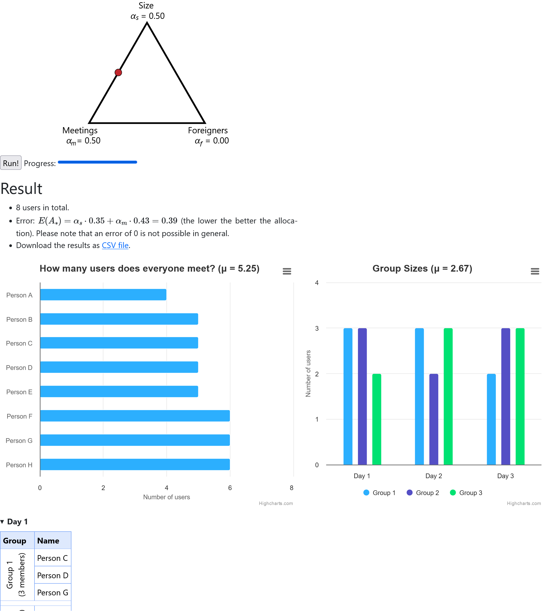

# World Café (Group Allocation)
<div align="center">
   <a href="misc/example_run.png"></a>
</div>

Have you ever had to organize a [world café](https://en.wikipedia.org/wiki/World_caf%C3%A9_(conversation)) but you struggled how to best split people across the tables while avoiding that always the same people talk to each other? This tool solves these kind of problems where you need to split people to groups with exchanges across tables or days. For example, you can use it to design a multi-day course programme where users are split into several groups and then one group is assigned to a lecturer per day. However, instead of using fixed groups, this tool finds a better allocation with the goal to increase the number of meetings between the users. More details can be found on the webpage for the tool.

[★ Demo ★](https://world-cafe.jansellner.net)

Below you find more information on how to host the tool yourself and some information for developers.

## Getting Started
- You have two options to run the webserver:
   1. Run the webserver in debug mode: clone this repository, build and run the dockerfile via `docker compose up --build`
   2. Run the webserver in production mode: use the [pre-built image](https://hub.docker.com/r/milania/group_allocation) from DockerHub: `docker run -it -p 5000:5000 milania/group_allocation`
- Navigate to [http://127.0.0.1:5000](http://127.0.0.1:5000)

## Development
### Core Algorithm
The core algorithm is written in [C++](group_allocation_c++) (and [Python](group_allocation_python)). In both cases, it is a standalone program which finds a good allocation given the number of users and groups. It can be called from the command line (C++ version inside docker)
```
/group_app/group_allocation_c++/x64/Release# ./group_allocation_c++.exe --n_groups 3 --n_users 6
# ...
[[0,2,2,0,1,1],[1,0,1,2,0,2],[2,1,0,1,2,0]]
```
In this case, it returns an allocation for 6 users who participate in a three-day course programme with three groups. For more details on the usage, see `/group_app/group_allocation_c++/x64/Release# ./group_allocation_c++.exe --help`.

To make changes to the program, just open the corresponding Visual Studio 2019 solution file (there are no further dependencies).

### Server
A small UI is built around the command line program in the form of a simple web app. It provides a visualization of the program output (e.g. distribution of user meetings) and allows to export the result as a CSV table.

The server is written in [Flask](https://palletsprojects.com/p/flask/) and can be started by running the `run_server.py` file. The dependencies can be installed via `pip install -r requirements.txt`. Set the environment variable `HOSTING_INFORMATION` to add custom hosting information to the end of the webpage.
